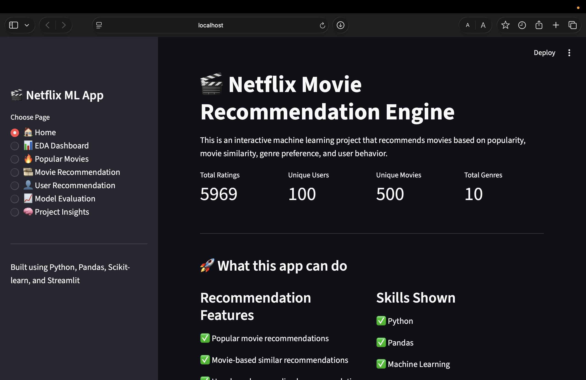
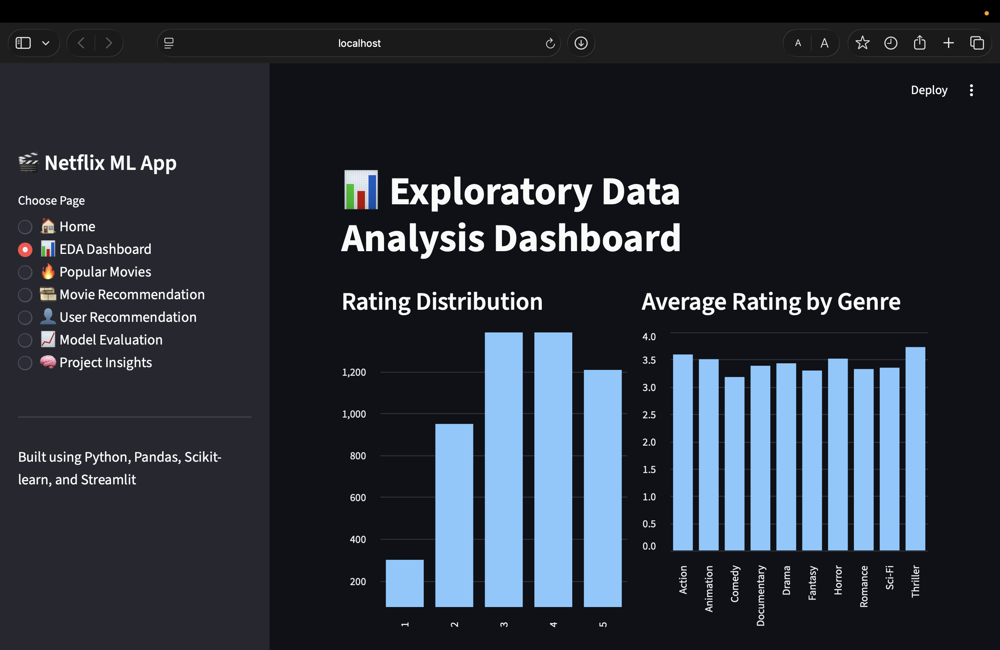
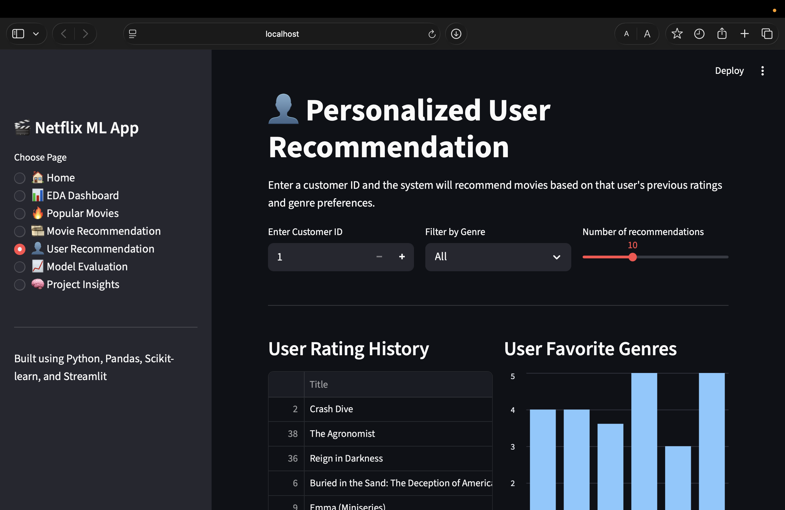

# 🎬 Netflix Movie Recommendation Engine

## 📌 Project Overview

The **Netflix Movie Recommendation Engine** is a machine learning-based capstone project designed to recommend movies to users based on their ratings, movie preferences, genres, and viewing behavior.

The project simulates how OTT platforms like Netflix, Amazon Prime, and Disney+ recommend personalized content to users. It includes data cleaning, exploratory data analysis, recommendation system development, model evaluation, and an interactive Streamlit web application.

---

## 🎯 Problem Statement

Recommendation engines play a major role in modern OTT and streaming platforms. Users often have many movie options, but finding the right movie can be difficult. This project solves that problem by recommending suitable movies based on user behavior, movie ratings, genre preferences, and movie similarity.

The main goal is to build a recommendation engine that can:
- Identify popular and highly rated movies
- Recommend similar movies
- Recommend personalized movies for a user
- Analyze genre-wise rating behavior
- Evaluate machine learning model performance

---

## ✅ Objectives

1. Find the most popular and liked movie genres.
2. Identify best-rated and worst-rated genres based on user ratings.
3. Build a popularity-based movie recommendation system.
4. Build a content-based recommendation system using TF-IDF and cosine similarity.
5. Build a user-based recommendation system using user rating behavior.
6. Create a hybrid recommendation system.
7. Add model evaluation using RMSE and MAE.
8. Deploy the project as an interactive Streamlit web application.

---

## 📂 Dataset Description

The project uses a Netflix-style ratings dataset.

| Column Name | Description |
|---|---|
| CustomerID | Unique ID of the customer/user |
| MovieID | Unique ID of the movie |
| Rating | Rating given by the user |
| Title | Name of the movie |
| Genre | Movie category/genre |
| Year | Movie release year |

---

## 🛠️ Tech Stack

| Category | Tools / Libraries |
|---|---|
| Programming Language | Python |
| Data Analysis | Pandas, NumPy |
| Visualization | Streamlit Charts |
| Machine Learning | Scikit-learn |
| Recommendation System | TF-IDF, Cosine Similarity, Hybrid Scoring |
| Model Evaluation | RMSE, MAE |
| Web App | Streamlit |
| Model Storage | Pickle |
| Version Control | Git, GitHub |

---

## 🚀 Project Features

### 1. Home Page
- Displays project overview
- Shows total users, movies, ratings, and genres
- Explains the purpose of the recommendation engine

### 2. EDA Dashboard
- Rating distribution analysis
- Average rating by genre
- Number of ratings by genre
- Movies released by year
- Genre summary table

### 3. Popular Movies Recommendation
- Recommends movies based on average rating and rating count
- Uses a popularity score formula
- Supports genre filtering

### 4. Movie-Based Recommendation
- Recommends similar movies based on selected movie
- Uses TF-IDF vectorization
- Uses cosine similarity
- Provides similarity score

### 5. User-Based Recommendation
- Recommends movies for a selected customer
- Uses user rating history and genre preferences
- Shows user favorite genres
- Displays personalized movie recommendations

### 6. Model Evaluation
- Trains a rating prediction model
- Evaluates model using RMSE and MAE
- Allows user to predict rating for a selected movie

### 7. Project Insights
- Shows best-rated genre
- Shows lowest-rated genre
- Shows most-rated genre
- Explains business importance and ML techniques

---

## 🧠 Recommendation Techniques Used

### 1. Popularity-Based Recommendation

This method recommends movies that are generally popular among all users.

```python
popularity_score = average_rating * log(1 + rating_count)
```

This helps recommend movies that have both good ratings and enough user engagement.

### 2. Content-Based Recommendation

This method recommends movies similar to a selected movie.

It uses:
- Movie title
- Genre
- Release year
- TF-IDF vectorization
- Cosine similarity

### 3. User-Based Recommendation

This method recommends movies based on a user's past rating behavior.

It analyzes:
- Movies watched by the user
- Ratings given by the user
- Favorite genres
- Unwatched movies

### 4. Hybrid Recommendation System

The hybrid system combines multiple factors:

```text
Hybrid Score = Movie Rating Score + Genre Preference Score + Popularity Score
```

This provides more balanced and personalized recommendations.

---

## 📈 Model Evaluation

The project includes a machine learning rating prediction model.

| Metric | Meaning |
|---|---|
| RMSE | Root Mean Squared Error |
| MAE | Mean Absolute Error |

Lower RMSE and MAE values indicate better model performance.

---

## 📁 Project Structure

```text
netflix-recommendation-engine/
│
├── app.py
├── README.md
├── requirements.txt
│
├── data/
│   └── netflix_ratings.csv
│
├── models/
│   ├── rating_prediction_model.pkl
│   ├── user_encoder.pkl
│   ├── movie_encoder.pkl
│   ├── genre_encoder.pkl
│   ├── tfidf_vectorizer.pkl
│   ├── cosine_similarity.pkl
│   ├── movie_stats.pkl
│   ├── movies.pkl
│   └── model_metrics.pkl
│
├── src/
│   └── train_models.py
│
├── notebooks/
│   ├── 01_data_cleaning.ipynb
│   ├── 02_eda.ipynb
│   ├── 03_recommendation_models.ipynb
│   └── 04_model_evaluation.ipynb
│
├── report/
│   └── Netflix_Recommendation_Engine_Report.pdf
│
└── presentation/
    └── Netflix_Recommendation_Engine_Interactive_PPT.pptx
```

---

## ⚙️ Installation and Setup

### Step 1: Clone the Repository

```bash
git clone https://github.com/YOUR_USERNAME/netflix-recommendation-engine.git
cd netflix-recommendation-engine
```

### Step 2: Create Virtual Environment

```bash
python3 -m venv .venv
source .venv/bin/activate
```

For Windows:

```bash
.venv\Scripts\activate
```

### Step 3: Install Required Libraries

```bash
pip install -r requirements.txt
```

### Step 4: Run the Streamlit App

```bash
streamlit run app.py
```

After running, open the local URL shown in the terminal:

```text
http://localhost:8501
```

---

## 📦 Requirements

Create a `requirements.txt` file with:

```text
streamlit
pandas
numpy
scikit-learn
matplotlib
```

---

## 📊 Expected Output

The application provides:
- Interactive dashboard
- Rating analysis
- Genre analysis
- Popular movie recommendations
- Similar movie recommendations
- Personalized user recommendations
- Model evaluation metrics
- Rating prediction feature

---

## 🖼️ Screenshots
## Screenshots

### Home Page


### Movie Recommendation System


### User-Based Recommendation System


### Hybrid Recommendation Output

---

## 📌 Business Use Case

OTT platforms use recommendation systems to:
- Increase user engagement
- Improve customer satisfaction
- Reduce search time
- Personalize user experience
- Increase watch time
- Improve platform retention

This project demonstrates how machine learning can solve a real-world recommendation problem.

---

## 🎓 Skills Demonstrated

- Python programming
- Data cleaning
- Exploratory data analysis
- Feature engineering
- Machine learning
- Recommendation systems
- Model evaluation
- Streamlit dashboard development
- Project documentation
- GitHub project structuring

---

## 🔮 Future Enhancements

1. Add deep learning-based recommendation models.
2. Use collaborative filtering with matrix factorization.
3. Add movie posters using TMDB API.
4. Add user login and real-time feedback.
5. Improve model performance using advanced algorithms.
6. Deploy the app on Streamlit Cloud.
7. Add cloud database support.
8. Add explainable recommendation reasons.

---

## 🧾 Resume Description

**Netflix Movie Recommendation Engine | Python, Pandas, Scikit-learn, Streamlit**

- Built a Netflix-style recommendation system using popularity-based, content-based, user-based, and hybrid recommendation techniques.
- Performed data cleaning and exploratory data analysis on user-movie rating data to identify rating trends and genre-level insights.
- Implemented TF-IDF and cosine similarity for movie-based recommendations.
- Developed a machine learning rating prediction model and evaluated it using RMSE and MAE.
- Created an interactive Streamlit web app with EDA dashboard, movie recommendations, user recommendations, and model evaluation.

---

## 👨‍💻 Author

**Kummari Thirumala Raju**

Capstone Project: Netflix Movie Recommendation Engine using Machine Learning

---

## ⭐ Conclusion

This project successfully demonstrates how a recommendation engine can be built using Python and machine learning. It includes data analysis, recommendation algorithms, model evaluation, and an interactive web application. The project is suitable for academic submission, resume building, GitHub portfolio, and interview explanation.
